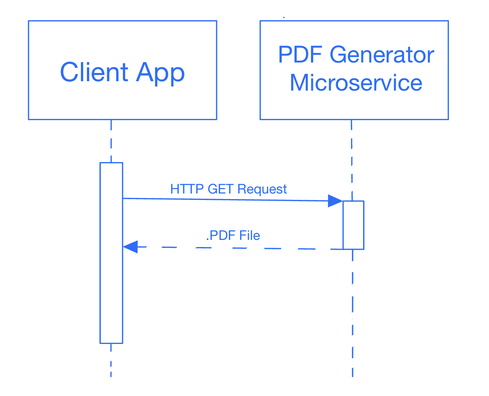

# Microservice Communication Contract

## Background
- This microservices receives get requests with json objects, and returns a downloadable pdf with the formatted content of the request.

## Requesting Data
- Provide data in the JSON structure shown below:
```http
GET http://localhost:5555/pdf HTTP/1.1
content-type: application/json

{
    "userName":          "Molly Doe",
    "hiringManagerName": "Rick Smith",
    "userAddress":       "1701 SW Western Blvd, Corvallis, OR, 97331",
    "companyAddress":    "1500 SW Jeffeson St, Corvallis, OR, 97331",
    "letterContent":     "I am writing to express my interest ..."
}
```

## Receiving Data
- The requesting service will receive a pdf download in the body.

## UML Sequence Diagram

